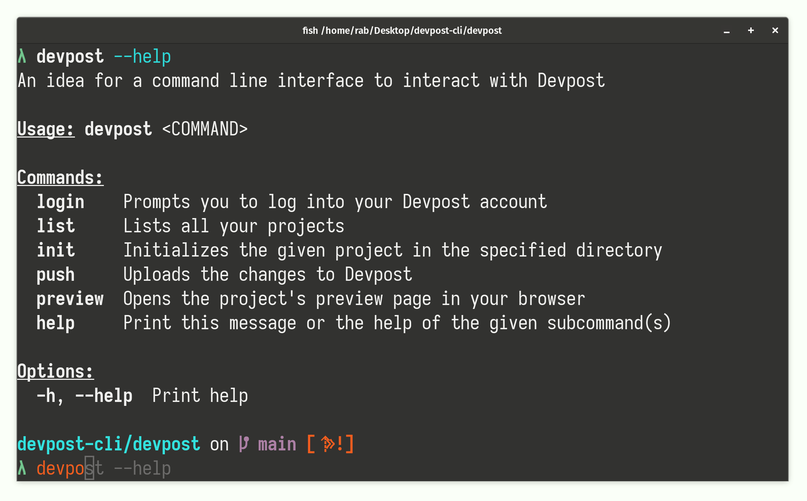

[](https://github.com/SilentByte/devpost-cli) &nbsp;
[](https://github.com/SilentByte/devpost-cli) &nbsp;
[](https://github.com/SilentByte/devpost-cli)


# DevpostCLI

Devpost CLI is a concept for a Command Line Interface used to interact with Devpost.com. The idea is to more closely tie the information provided on Devpost (such as project name, description, instructions, images, etc.) with the code repository that is ultimately submitted.

This reduces information duplication and allows hackathon participants to keep everything in one place (the true source of information).

This repository represents our submission for the [Hack Devpost Hackathon](https://hackdevpost.devpost.com/).




## Video Submission

[Click here to watch the submission video.](https://www.youtube.com/watch?v=kK75PC9GS7g)

[](https://www.youtube.com/watch?v=kK75PC9GS7g)


## Inspiration

I have participated in a number of Devpost hackathons (this is my 12th 😊) and the idea for this project arose out of a minor annoyance when uploading submissions to Devpost. As a software engineer, I like to keep information at a central location, i.e. the project repository. Unfortunately, when submitting hackathons I have to duplicate information. Most notably, this is the case with the `README.md` file. `README.md` contains all necessary information and lives in the project's repository, but its contents have to be copied over to Devpost when submitting.

To make my intentions clearer, I like to use graphics and diagrams embedded in `README.md` using relative URLs. This is not possible when submitting to Devpost, and I have to go over the entire submission and replace all relative URLs with absolute URLs. Finally, to make matters worse, Devpost is caching these images, which means I have to change their URLs every time I update the images to force the cache to be invalidated.

In an ideal world, there should be a way to let Devpost know where to find the project description and all associated information. This is what this concept submission tries to address.

Having a tighter integration between project repositories and Devpost to manage projects will streamline the entire workflow and make Devpost much more accessible to developers, alleviating code and documentation duplication, avoiding caching issues, and reduces the chance of having outdated or diverging information.


## What it does

The CLI, once connected to a Devpost API, will allow users to create and manage projects from the command line. This is the help text when running `devpost --help`:

```
An idea for a command line interface to interact with Devpost

Usage: devpost <COMMAND>

Commands:
  login    Prompts you to log into your Devpost account
  list     Lists all your projects
  init     Initializes the given project in the specified directory
  push     Uploads the changes to Devpost
  preview  Opens the project's preview page in your browser
  help     Print this message or the help of the given subcommand(s)

Options:
  -h, --help  Print help
```

A typical workflow is intended to look like this:

1) The user runs `devpost login` and enters Devpost login credentials (e-mail/password). Alternative mechanisms such as Google authentication, Github authentication, or API keys can be made available.

2) The user runs `devpost init myproject .` to create a new project in the current working directory. The user will be prompted with basic questions regarding the project to set it up. This information is stored in a configuration file called `Devpost.yml`.

3) The configuration file `Devpost.yml` can be edited manually to add more information required by Devpost for a valid submission. This includes, for example, an URL to the presentation video. An example of a configuration file listed below. Note that we are directly linking `README.md` to let Devpost know that we want to use the README file of the repository instead of providing a (duplicate) description on the website.

```yaml
identifier: hackdevpost
name: Devpost CLI
summary: This is the project's elevator pitch!
thumbnail: thumbnail.gif
description: README.md
built_with:
    - Rust
    - Markdown
links:
    - https://github.com/SilentByte/devpost-cli
    - https://devpost.com/software/hackdevpost
images:
    - docs/banner.png
video_url: "TODO: ADD YOUTUBE URL"
```

4. To synchronize the changes and upload the data to Devpost, the user runs `devpost push`.

5. Running `devpost preview` opens the project's preview page, e.g. https://devpost.com/software/hackdevpost.

6. Once the user has finalized the project, it can be submitted on Devpost along with all additional information required (e.g. questionnaires). Alternatively, a `devpost submit` command could be considered.


## How we built it

The mock prototype is built using Rust. You can find [instructions to install Rust here](https://rustup.rs).

To test the CLI application, simply run the following command to build and execute the program:

```
cargo run -- --help
```

To build and install the application into `~/.local/bin/devpost`, run the following command:

```
./install.sh
```


## What's next for Devpost CLI

As this is just an idea in the form of a mock prototype, what's next is the actual implementation against a real Devpost API. The cool thing with this idea is that the application can be extended to facilitate other types of hackathons.

For instance, if Devpost decided to also host hackathons that are more focused on Machine Learning, Devpost CLI could could assist in the creation of development environments, downloading data relevant to specific challenges, and uploading the models that have been trained on the data for server-side evaluation and the automatic determination of the winners(i.e. testing a participant's trained model against a hidden dataset to account for overfitting/bias to determine how well it actually works).

For more details, watch the video linked above.
